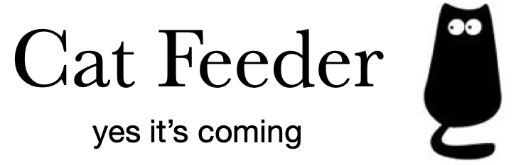

#### A smart feed guided by semantic AI. You won't miss what matters.  

How does it work? In short, `Cat Feeder` runs an efficient proprietory algorithm on a vast number of data points to figure out similar users and similar posts. 


To determine to what extent any two **users are similar**, our algorithm makes use of the following key data points:

* age group (as per user profile)
* gender (inferred by AI)
* interests (self-reported by user)


To establish **similarity between any two posts** our system focuses on 
* post text, i.e. what has been written
* hashtags added by users (if any)
* explicitly created relationships between posts, e.g. some are replies to others


This similarity knowledge is then used to understand what a user who just logged in may be into. One that's done, `Cat Feeder` reviews millions of posts to pick a few that deserve attention and shows them in the feed.

### Quick Start

Using `Cat Feeder` is really simple. Here's one of the most popular scenarios to integrate it in your app and greet your user whose ID is `f84-7a5-45-a9-91ef` with an AI-optimised feed:
```
import datetime
from cat_feeder import CatFeeder

cf = CatFeeder().feed(uid='f84-7a5-45-a9-91ef', 
					  current_time=datetime.datetime.utcnow())
```

A list of posts IDs to show to the user is now available in `cf.posts_to_show` . Note that the list shows the more recommended posts first:
```
cf.posts_to_show

['5aa337f6-e9e2-489b-8a22-f4e87d2c6ef5',
 'c7341bf2-1c19-41ec-8b0d-3bb0040824b3',
 '5858955c-68c4-4674-9fff-acd968eae9a4']

```


